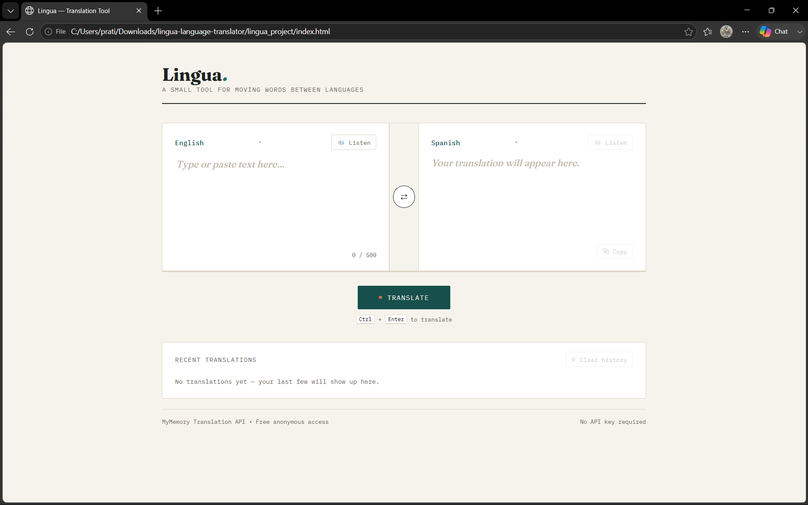
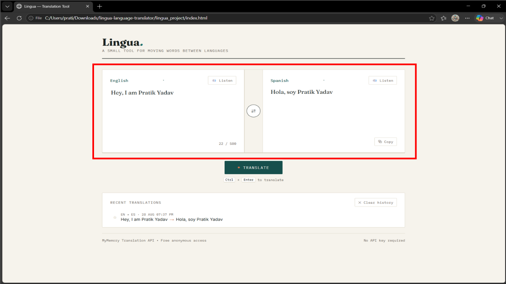
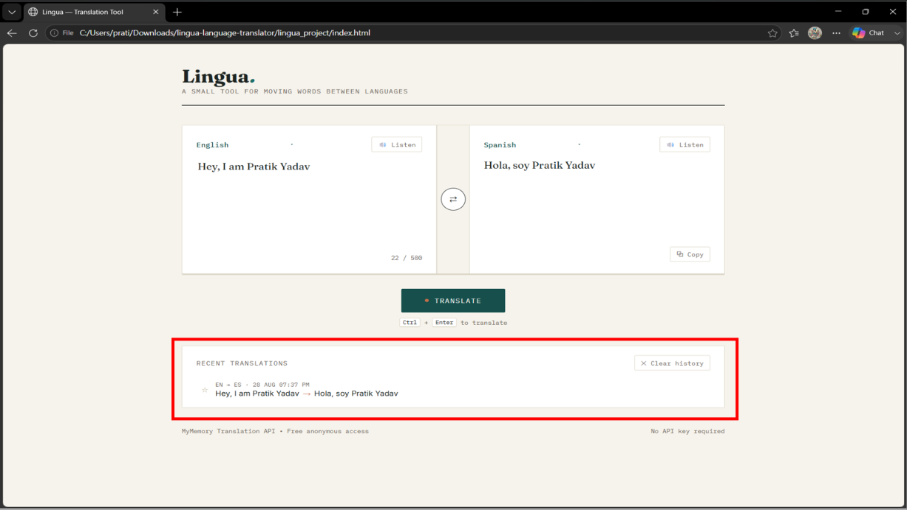
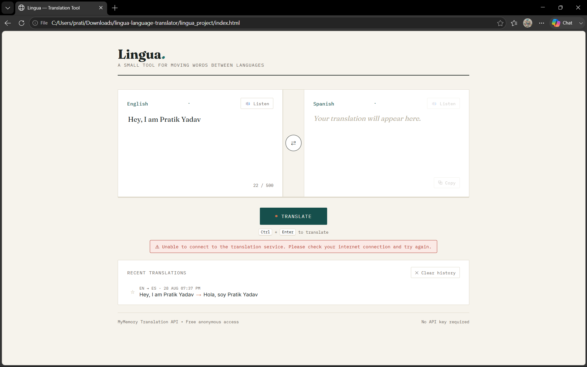

# Lingua — Language Translation Tool

A small, self-contained web app for translating text between languages, built with plain HTML, CSS, and JavaScript (no build step, no framework).

## 🚀 Live Demo

View Lingua Translator → https://pratik-aiml-25.github.io/CodeAlpha-Internship-Tasks-Language-Translation-Tool/
## Overview

Lingua lets you type or paste text, pick a source and target language, and get a translation back from a free public translation API. It also supports text-to-speech playback, copying the result, and a local history of your last few translations.

## Features

- **Text input** with a 500-character limit and a live counter that turns amber near the limit and red at the limit.
- **Source and target language selection** (24 languages — see list below).
- **Swap button** to flip source/target languages (and reuse the last translation as new input).
- **Translate button** that calls the MyMemory Translation API and displays the result.
- **Robust error handling** for network failures, non-200 HTTP responses, malformed JSON, and MyMemory's own quota/rate-limit messages (which it sometimes returns with an HTTP 200 status — see [Limitations](#limitations)).
- **Copy button** to copy the translated text to the clipboard.
- **Text-to-speech** ("🔊 Listen") for both the source text and the translation, using the browser's built-in Web Speech API.
- **Translation history** — the last 8 translations are saved locally in your browser (`localStorage`) and shown below the translator. Click any entry to reload it.
- **Pin/favorite a history entry** — click the star (☆/★) on any history row to pin it. Pinned entries move to a "📌 Pinned" section, don't count toward the 8-entry cap (so they can't get pushed out by newer translations), and survive "Clear history" — that button clears unpinned entries only and relabels itself "Clear recent" once something's pinned.
- **Ctrl/Cmd + Enter to translate** is now hinted directly under the Translate button (shows "Cmd" on Mac, "Ctrl" elsewhere).
- **No Auto Detect.** You choose the source language explicitly; the app does not guess it for you.

## API used

This project uses the **[MyMemory Translation API](https://mymemory.translated.net/doc/spec.php)** — specifically:

```
GET https://api.mymemory.translated.net/get?q={text}&langpair={source}|{target}
```

- It is **free and requires no API key** for anonymous use, which is why it was chosen for this project.
- It is **not** Google Translate or Microsoft Translator. Those require a paid/registered API key and, in the case of Google, a backend proxy (their API blocks direct browser calls via CORS). If you have credentials for either of those, the `translate()` function in `script.js` is the only place that would need to change.
- Anonymous usage is subject to **MyMemory's current service limits** (their documentation has historically cited a daily word cap per IP, with a higher cap available if you register an email address via a `de=` parameter). Exact numbers are not hard-coded into this app's UI or docs, since MyMemory can change them at any time — check [their spec page](https://mymemory.translated.net/doc/spec.php) for the current figure before relying on it.
- MyMemory sometimes returns **HTTP 200 with an error message embedded in the `translatedText` field itself** (e.g. quota exceeded, invalid language pair) instead of a proper HTTP error code. `script.js` checks for these known warning strings in addition to checking `response.ok` and the JSON `responseStatus` field, and surfaces a clear message instead of displaying the raw warning as if it were a translation.

## Project structure

```
translator-project/
├── index.html   # Page structure/markup only
├── style.css    # All styling
├── script.js    # All behavior: API calls, history, TTS, etc.
└── README.md
```

## Setup

No installation or build step is required.

1. Download/clone the three files (`index.html`, `style.css`, `script.js`) into the same folder.
2. Open `index.html` directly in a modern browser (Chrome, Edge, Firefox, or Safari), **or** serve the folder with any static file server, e.g.:
   ```
   npx serve .
   ```
   or
   ```
   python3 -m http.server
   ```
3. Start typing, choose your languages, and press **Translate** (or `Ctrl/Cmd + Enter`).

An internet connection is required, since translation requests go out to MyMemory's API and font/icon assets are loaded from Google Fonts.

## Supported languages

English, Spanish, French, German, Italian, Portuguese, Russian, Japanese, Korean, Chinese (Simplified), Arabic, Hindi, Bengali, Dutch, Turkish, Polish, Vietnamese, Thai, Swedish, Greek, Hebrew, Indonesian, Ukrainian, Czech.

(This is the list wired into the two `<select>` dropdowns in `index.html` — MyMemory supports many more language codes than this if you want to extend the list.)

## Limitations

- **Free-tier translation quality.** MyMemory is a community/translation-memory-based free API, not a dedicated neural MT engine like Google/DeepL/Microsoft. Quality can vary, especially for longer or more idiomatic text.
- **Rate limits.** Anonymous use is subject to MyMemory's current daily word limit per IP (see the API section above — the exact number isn't hard-coded here since MyMemory can change it). Once that limit is hit, MyMemory returns a warning message instead of a translation; the app detects this and shows an error rather than displaying the warning as a translation, but it cannot bypass the limit itself.
- **500-character input cap.** This is a deliberate app-side limit (not an API limit) to keep requests small and fast; MyMemory's own per-query limit is higher.
- **No offline support.** Every translation requires a live network request; there's no bundled dictionary or offline fallback.
- **Text-to-speech depends on the browser/OS.** Available voices and language coverage for the "Listen" buttons come from the Web Speech API, which varies by browser and operating system — some languages may not have an installed voice on a given device.
- **History is local and per-browser.** It's stored in `localStorage` on the device/browser it was created in — it is not synced anywhere, is not shared between devices, and will be lost if the user clears site data or uses a different browser/private window. It is also not encrypted; anyone with access to that browser profile can read it via dev tools.
- **No Auto Detect.** By design (per project requirements), the app does not attempt to detect the source language automatically — this was deliberately left out rather than faked.
- **No authentication or per-user accounts.** This is a single-user, client-only tool; there is no server component.

## Screenshots


_Default view with the two panels and translate button._


_After a successful translation, with recent entries listed below._


_The "Recent Translations" panel with a pinned entry and a "Clear recent" action._


_The status message shown after a simulated API/network error._

## Testing status

The application has been manually tested in Chrome against the live MyMemory API. Core translation, validation, history, pinning, swap, copy, text-to-speech, character limits, keyboard interaction, responsive behavior, and network-error handling have been tested.

### Suggested manual test checklist (run this before submission)

1. Translate a short sentence between two language pairs you can read (e.g. EN→ES) and check the result looks reasonable.
2. Press Translate with an empty input box — confirm you get the "type something first" message and no network request.
3. Set source and target to the same language — confirm it echoes the text back without an API error.
4. Type past ~440 and then ~490 characters — confirm the counter turns amber, then red, and typing stops at 500.
5. Use the swap (⇄) button after a translation — confirm languages flip and the translated text moves into the input box.
6. Press Copy after a translation — confirm the button briefly shows "Copied" and the clipboard actually has the text.
7. Press "🔊 Listen" on both sides — confirm audio plays (voice availability depends on your OS/browser).
8. Translate a few different things in a row — confirm they appear in "Recent Translations", most recent first, and that clicking one reloads it.
9. Press "Clear history" — confirm the list empties and stays empty after a page reload.
10. Turn off your network (or block the request in DevTools) and press Translate — confirm you get a plain-language message ("Unable to connect to the translation service. Please check your internet connection and try again."), not a raw browser error like "Failed to fetch" or a blank screen.
11. Star (pin) a history entry, then translate several more times past the 8-entry cap — confirm the pinned entry stays visible under "📌 Pinned" instead of getting pushed out, and that "Clear history" (now labeled "Clear recent") leaves it alone. Unpin it and confirm it moves back into "Recent" and can be cleared normally.
12. Resize the browser (or use DevTools device mode) to 320px, 375px, and 768px widths — confirm the panels stack correctly below 640px, nothing overflows horizontally, and the Ctrl/Cmd+Enter hint and status pill stay readable.
13. Tab through the whole page with the keyboard only (selects, Listen, textarea, Translate, swap, Copy, history pin/reload buttons, Clear history) — confirm focus is always visible and every control is reachable and operable without a mouse.

If all 13 pass on your machine/browser, Task 1 is ready to freeze.
